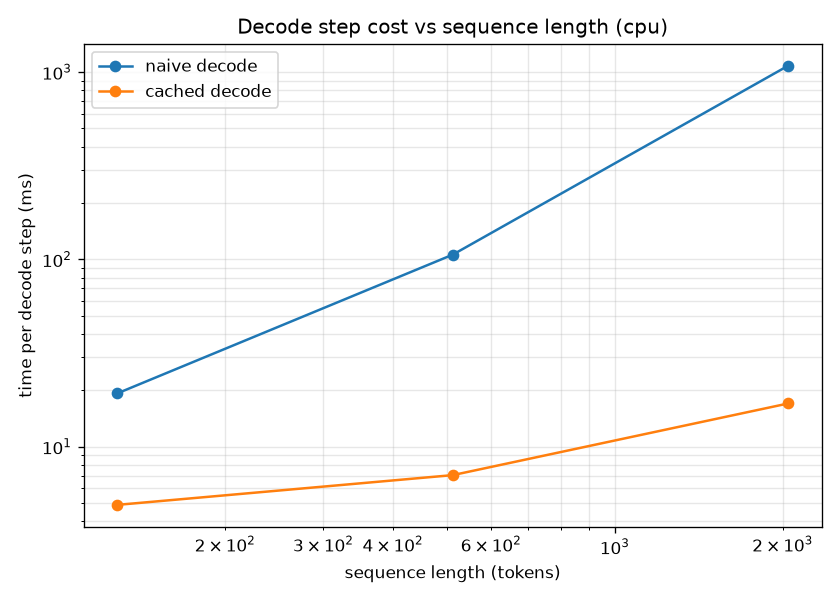
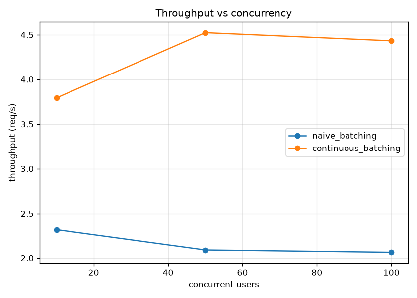
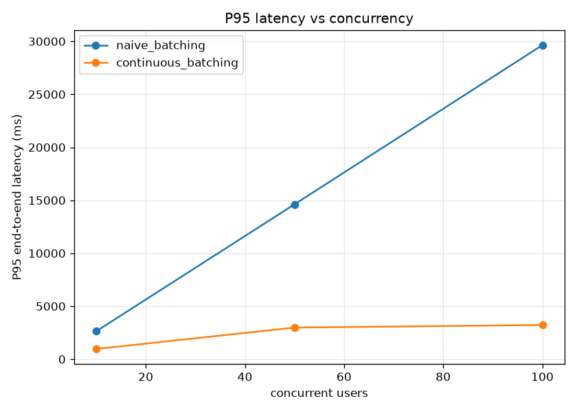

# LLM Serving Lab

A pedagogical reimplementation of the LLM serving stack — KV cache,
continuous batching, paged memory, and a gateway — written to understand
how vLLM, TGI, and TensorRT-LLM actually work.

Five layers, built in order:

| Layer | Directory | Status |
|---|---|---|
| KV cache | `01_kv_cache/` | ✅ done |
| Continuous batching | `02_batching_sim/` | ✅ done |
| Paged memory | `03_paged_memory/` | planned |
| vLLM config sweep | `04_serving_benchmarks/` | planned |
| FastAPI gateway | `05_gateway/` | planned |

## 1. KV cache

### What it is

Autoregressive generation predicts one token at a time: each step feeds the
whole sequence-so-far through the model and samples the next token. The naive
implementation recomputes attention over the entire prefix at every step,
which makes each decode step O(L²) in attention and O(L) in MLP, where L is
the current sequence length.

A KV cache stores the key and value tensors from every layer after each step
and reuses them. The decode step then computes attention for only the new
token — O(L) instead of O(L²) — and runs the MLP for one token — O(1) instead
of O(L).

### What we built

- A tiny GPT (~13.8M params, 6 layers, 6 heads, 384 dim) with
  KV-cache-aware attention (`01_kv_cache/model.py`).
- Two generation paths: `generate_naive` (recompute every step) and
  `generate_cached` (prefill once, then one token per step).
- An equivalence test proving both paths produce bit-identical output.
- A benchmark harness that isolates the cost of a single decode step at
  sequence lengths 128, 512, and 2048.

### Results (CPU, fp32)

| Sequence length | Naive decode | Cached decode | Speedup |
|---|---|---|---|
| 128  | 19.24 ms  | 4.89 ms  | 3.9×  |
| 512  | 105.94 ms | 7.05 ms  | 15.0× |
| 2048 | 1082.12 ms| 17.02 ms | 63.6× |



### What the numbers mean

**Speedup grows with sequence length.** The naive path's cost per decode step
scales quadratically with the prefix; the cached path scales linearly. Over a
full generation of T tokens, this is the difference between O(T³) and O(T²)
total attention work — which is why no production LLM serves without a
KV cache.

**Cached decode has a constant floor.** Fitting `T(L) = a + b·L` to the
cached measurements gives a ≈ 4.1 ms (the per-step constant — MLP, LayerNorms,
embeddings, sampling) and b ≈ 0.0063 ms per cached token (the linear attention
term). At L=128 the floor is ~83% of the cost; at L=2048 it's ~24%. This floor
is the target of the next layer: **continuous batching exists to amortize the
constant per-step cost across concurrent requests.**

**The cache itself costs memory.** KV cache size per sequence is
`2 × n_layer × n_head × head_dim × L × dtype_bytes`. At L=2048, fp32, that's
≈ 37.7 MB per sequence — linear in both sequence length and concurrency. This
is what Milestone 3's paged memory model will manage.

### Reproduce

```bash
uv run 01_kv_cache/benchmark.py
```

## 2. Continuous batching

### What it is

Autoregressive serving processes one decode step at a time. When multiple
requests are in flight, the scheduler decides how many to run in each step
and when to admit new requests. Two policies:

- **Naive (static) batching:** collect `max_batch_size` requests, run them
  to completion, then take the next batch. A request that finishes early
  leaves its slot idle until the slowest member finishes.
- **Continuous (iteration-level) batching:** at every decode iteration,
  refill any free slots from the queue. A request that finishes frees its
  slot immediately; a new request is prefilled and joins the next step.

The idea is from [Orca (Yu et al., 2022)](https://www.usenix.org/conference/osdi22/presentation/yu)
and is the core innovation in vLLM, TGI, and TensorRT-LLM.

### What we built

A token-level scheduler simulator — no real model, no GPU. The cost of
each scheduling decision is modeled by a simple latency function
(`02_batching_sim/simulator.py:CostModel`), so we can isolate the
*scheduling* effect from compute and memory.

- `simulator.py` — request, cost model, result types
- `policies.py` — naive and continuous batchers
- `workloads.py` — Poisson arrivals, log-normal prompt/output lengths
- `benchmark.py` — 10/50/100 users × both policies, produces CSV + charts

### Results

Workload: Poisson arrivals at 5 req/s, log-normal prompt length (median 50)
and output length (median 80), `max_batch_size=8`.

| users | policy | throughput | TTFT P50 | P95 e2e latency |
|---|---|---|---|---|
| 10  | naive      | 2.32 req/s | 1370 ms   | 2631 ms  |
| 10  | continuous | 3.79 req/s | 13 ms     | 964 ms   |
| 50  | naive      | 2.09 req/s | 6004 ms   | 14615 ms |
| 50  | continuous | 4.52 req/s | 18 ms     | 2983 ms  |
| 100 | naive      | 2.06 req/s | 12445 ms  | 29644 ms |
| 100 | continuous | 4.43 req/s | 18 ms     | 3225 ms  |




### What the numbers mean

**Naive throughput degrades with concurrency; continuous stays flat.**
Naive batches wait for their slowest member. As concurrency rises, the
number of batches rises, and each one is a fresh draw from a heavy-tailed
output-length distribution. More batches → more straggler stalls → lower
average throughput. Continuous decouples slots: a long request occupies
one, other slots keep turning over.

**Tail latency diverges by ~9× at 100 users.** Naive queues requests
behind full batches, so tail latency explodes. Continuous admits each
request as soon as a slot opens.

**Continuous also wins at low concurrency — for a different reason.**
At 10 users, naive TTFT P50 is 1.4 s because the batcher *waits* for a
full batch to assemble. Continuous starts the moment a request arrives.
So the win isn't only "throughput under load"; it's also "no batch-fill
wait at low load."

### The tradeoff

Continuous batching is a throughput and tail-latency win, not a free
lunch. Two honest costs:

1. **Prefill interference.** When a new request joins, its prefill blocks
   the current decode step, briefly raising ITL for requests already in
   the batch. Production systems mitigate this with *chunked prefill*
   (split prefills into small pieces and interleave with decode). Our
   simulation shows a small ITL effect because prefills are cheap here;
   with long prompts it would dominate.
2. **Scheduler complexity.** Iteration-level bookkeeping (per-request
   state, KV cache lifetimes, fairness) is more intricate than
   "run this batch."

Both are why serving engines are nontrivial software.

### Reproduce

    uv run 02_batching_sim/benchmark.py

### Next

The scheduler models a batch's *cost* but not the *memory* its requests
occupy. In real serving, each running request holds a KV cache that grows
with its sequence length. Milestone 3 builds a paged memory model to
allocate and free those caches without fragmenting GPU memory.