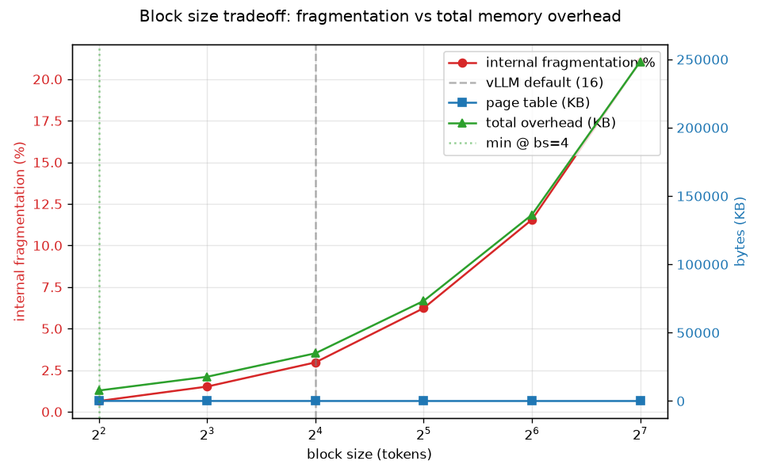
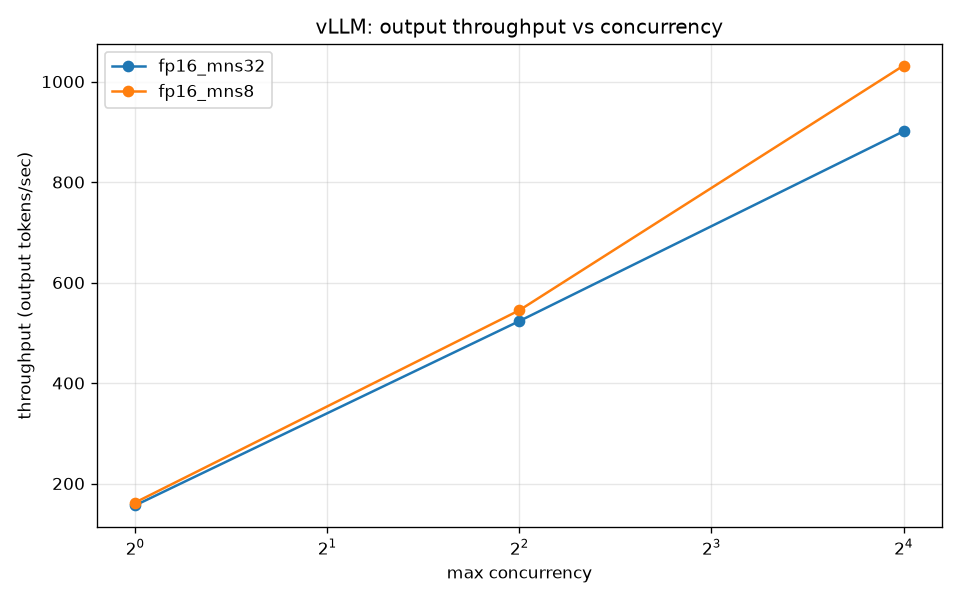
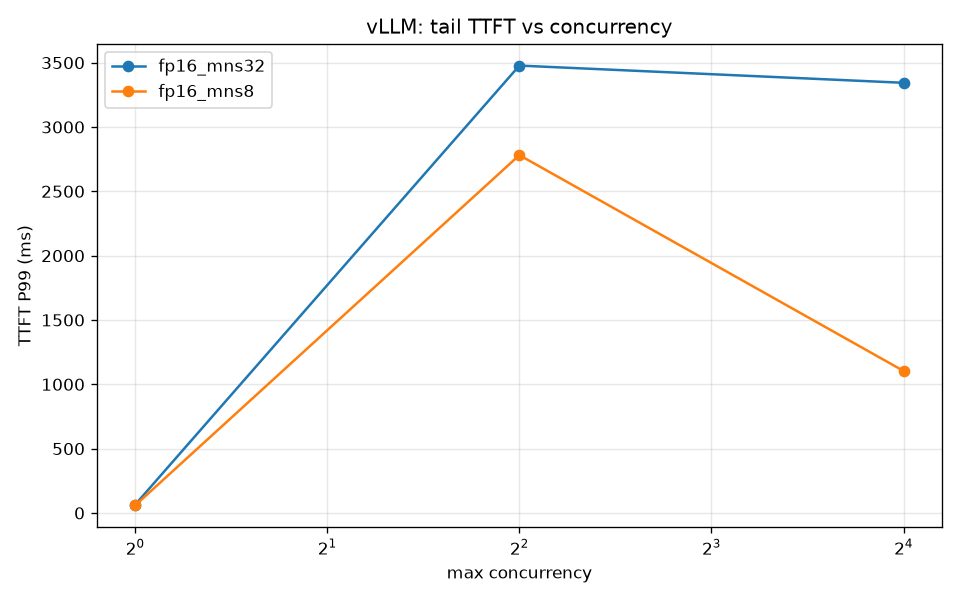

# LLM Serving Lab

A pedagogical reimplementation of the LLM serving stack — KV cache,
continuous batching, paged memory, and a gateway — written to understand
how vLLM, TGI, and TensorRT-LLM actually work.

Five layers, built in order:

| Layer | Directory | Status |
|---|---|---|
| KV cache | `01_kv_cache/` | ✅ done |
| Continuous batching | `02_batching_sim/` | ✅ done |
| Paged memory | `03_paged_memory/` | ✅ done |
| vLLM config sweep | `04_serving_benchmarks/` | ✅ done |
| FastAPI gateway | `05_gateway/` | ✅ done |

## 1. KV cache

### What it is

Autoregressive generation predicts one token at a time: each step feeds the
whole sequence-so-far through the model and samples the next token. The naive
implementation recomputes attention over the entire prefix at every step,
which makes each decode step O(L²) in attention and O(L) in MLP, where L is
the current sequence length.

A KV cache stores the key and value tensors from every layer after each step
and reuses them. The decode step then computes attention for only the new
token — O(L) instead of O(L²) — and runs the MLP for one token — O(1) instead
of O(L).

### What we built

- A tiny GPT (~13.8M params, 6 layers, 6 heads, 384 dim) with
  KV-cache-aware attention (`01_kv_cache/model.py`).
- Two generation paths: `generate_naive` (recompute every step) and
  `generate_cached` (prefill once, then one token per step).
- An equivalence test proving both paths produce bit-identical output.
- A benchmark harness that isolates the cost of a single decode step at
  sequence lengths 128, 512, and 2048.

### Results (CPU, fp32)

| Sequence length | Naive decode | Cached decode | Speedup |
|---|---|---|---|
| 128  | 19.24 ms  | 4.89 ms  | 3.9×  |
| 512  | 105.94 ms | 7.05 ms  | 15.0× |
| 2048 | 1082.12 ms| 17.02 ms | 63.6× |


### What the numbers mean

**Speedup grows with sequence length.** The naive path's cost per decode step
scales quadratically with the prefix; the cached path scales linearly. Over a
full generation of T tokens, this is the difference between O(T³) and O(T²)
total attention work — which is why no production LLM serves without a
KV cache.

**Cached decode has a constant floor.** Fitting `T(L) = a + b·L` to the
cached measurements gives a ≈ 4.1 ms (the per-step constant — MLP, LayerNorms,
embeddings, sampling) and b ≈ 0.0063 ms per cached token (the linear attention
term). At L=128 the floor is ~83% of the cost; at L=2048 it's ~24%. This floor
is the target of the next layer: **continuous batching exists to amortize the
constant per-step cost across concurrent requests.**

**The cache itself costs memory.** KV cache size per sequence is
`2 × n_layer × n_head × head_dim × L × dtype_bytes`. At L=2048, fp32, that's
≈ 37.7 MB per sequence — linear in both sequence length and concurrency. This
is what Milestone 3's paged memory model will manage.

### Reproduce

```bash
uv run 01_kv_cache/benchmark.py
```

## 2. Continuous batching

### What it is

Autoregressive serving processes one decode step at a time. When multiple
requests are in flight, the scheduler decides how many to run in each step
and when to admit new requests. Two policies:

- **Naive (static) batching:** collect `max_batch_size` requests, run them
  to completion, then take the next batch. A request that finishes early
  leaves its slot idle until the slowest member finishes.
- **Continuous (iteration-level) batching:** at every decode iteration,
  refill any free slots from the queue. A request that finishes frees its
  slot immediately; a new request is prefilled and joins the next step.

The idea is from [Orca (Yu et al., 2022)](https://www.usenix.org/conference/osdi22/presentation/yu)
and is the core innovation in vLLM, TGI, and TensorRT-LLM.

### What we built

A token-level scheduler simulator — no real model, no GPU. The cost of
each scheduling decision is modeled by a simple latency function
(`02_batching_sim/simulator.py:CostModel`), so we can isolate the
*scheduling* effect from compute and memory.

- `simulator.py` — request, cost model, result types
- `policies.py` — naive and continuous batchers
- `workloads.py` — Poisson arrivals, log-normal prompt/output lengths
- `benchmark.py` — 10/50/100 users × both policies, produces CSV + charts

### Results

Workload: Poisson arrivals at 5 req/s, log-normal prompt length (median 50)
and output length (median 80), `max_batch_size=8`.

| users | policy | throughput | TTFT P50 | P95 e2e latency |
|---|---|---|---|---|
| 10  | naive      | 2.32 req/s | 1370 ms   | 2631 ms  |
| 10  | continuous | 3.79 req/s | 13 ms     | 964 ms   |
| 50  | naive      | 2.09 req/s | 6004 ms   | 14615 ms |
| 50  | continuous | 4.52 req/s | 18 ms     | 2983 ms  |
| 100 | naive      | 2.06 req/s | 12445 ms  | 29644 ms |
| 100 | continuous | 4.43 req/s | 18 ms     | 3225 ms  |


### What the numbers mean

**Naive throughput degrades with concurrency; continuous stays flat.**
Naive batches wait for their slowest member. As concurrency rises, the
number of batches rises, and each one is a fresh draw from a heavy-tailed
output-length distribution. More batches → more straggler stalls → lower
average throughput. Continuous decouples slots: a long request occupies
one, other slots keep turning over.

**Tail latency diverges by ~9× at 100 users.** Naive queues requests
behind full batches, so tail latency explodes. Continuous admits each
request as soon as a slot opens.

**Continuous also wins at low concurrency — for a different reason.**
At 10 users, naive TTFT P50 is 1.4 s because the batcher *waits* for a
full batch to assemble. Continuous starts the moment a request arrives.
So the win isn't only "throughput under load"; it's also "no batch-fill
wait at low load."

### The tradeoff

Continuous batching is a throughput and tail-latency win, not a free
lunch. Two honest costs:

1. **Prefill interference.** When a new request joins, its prefill blocks
   the current decode step, briefly raising ITL for requests already in
   the batch. Production systems mitigate this with *chunked prefill*
   (split prefills into small pieces and interleave with decode). Our
   simulation shows a small ITL effect because prefills are cheap here;
   with long prompts it would dominate.
2. **Scheduler complexity.** Iteration-level bookkeeping (per-request
   state, KV cache lifetimes, fairness) is more intricate than
   "run this batch."

Both are why serving engines are nontrivial software.

### Reproduce
```bash
    uv run 02_batching_sim/benchmark.py
```
## 3. Paged KV memory

### The problem

A running request holds a KV cache that grows with its sequence length.
At admission time you don't know how long it will grow to. The naive
solution — reserve `max_seq_len` per sequence — wastes memory
proportional to the gap between the reservation and the actual length.

At `max_seq_len = 2048` and a real median length of ~200 tokens, that's
roughly 10× over-reservation per sequence. Multiply by concurrent
requests and the pool fills up before the compute does.

### What we built

A fixed-size block allocator with per-sequence page tables. Each
sequence's KV cache is split into fixed-size blocks (`BLOCK_SIZE` tokens
each) allocated on demand. A sequence's blocks are scattered across the
pool but indexed by a logical-to-physical mapping (`page_table`), so
attention reads look contiguous. Same idea as vLLM's PagedAttention.

Files:

- `block_manager.py` — allocator and page tables
- `fragmentation.py` — paged vs naive vs fixed-slot comparison
- `benchmark.py` — block-size sweep with memory overhead accounting

### Results — same pool, three strategies

Pool: 4,096 blocks × 16 slots = 65,536 token slots (~12 GB at this
model's KV geometry). Workload: 500 sequences, prompt ~logNormal(60, 0.7),
output ~logNormal(100, 0.8).

| strategy | admitted concurrent | waste |
|---|---|---|
| **paged (bs=16)** | **284** | 1,940 slots (3.0% of pool) |
| naive (reserve 2048) | 32 | 58,439 slots (89% of pool) |
| fixed (reserve 200) | 300 admitted, **200 rejected** | — |

**Paged admits 8.9× more concurrent sequences than naive pre-allocation**,
at bounded waste. The fixed-slot strategy admits slightly more than paged
but *rejects* 40% of requests that exceed the reservation — an unacceptable
trade in production.

### Block size tradeoff



Sweeping block size on a fixed slot pool:

- **Smaller blocks → less waste.** Waste per sequence is bounded by
  `BLOCK_SIZE - 1` slots. At bs=4, aggregate waste is 0.65% of the pool;
  at bs=128, it's 21%.
- **Smaller blocks → larger page tables.** Each logical block costs
  4 bytes of metadata per sequence. At bs=4, the pool needs 64 KB of
  page tables; at bs=128, 2 KB.
- **Total memory overhead is minimized at small blocks** in this model —
  the memory-optimal block size is bs=4.

### Why vLLM uses 16, not 4

Our model captures waste bytes and page-table bytes. It does **not**
capture kernel efficiency:

- Each logical block is a separate gather from global memory. Small
  blocks mean more gathers per attention step.
- GPU memory transactions are 32–128 bytes. A bs=4 block (fp16,
  6 heads × 64 head_dim) is ~3 KB — too small to amortize the transaction
  cost well.
- Larger blocks let the PagedAttention kernel amortize per-block overhead.

The memory-optimal block size is a lower bound. The realized production
choice (16) sits above it because the kernel imposes a cost the memory
model doesn't see. That gap is what the hardware benchmark in Milestone 4
will make visible.

### Reproduce
```bash
    uv run 03_paged_memory/fragmentation.py
    uv run 03_paged_memory/benchmark.py
```


## 4. vLLM on real hardware

### What we measured

Ran vLLM 0.30.0 on a Colab T4 serving `Qwen/Qwen2.5-0.5B-Instruct`. Swept
`max_num_seqs ∈ {8, 32}` at concurrency 1, 4, and 16. This is the first
milestone that touches a real engine on real hardware — everything before
was simulation.

Workload per run: 100 prompts, 128 input tokens, 128 output tokens, random
dataset, Poisson arrivals. Metrics from vLLM's `benchmark_serving`.

### Results (fp16)

| config | conc | output tps | TTFT P50 | TTFT P99 | e2e P50 | e2e P99 |
|---|---|---|---|---|---|---|
| mns=8  | 1  | 162  | 34 ms  | 59 ms    | 811 ms  | 852 ms   |
| mns=8  | 4  | 542  | 66 ms  | 2792 ms  | 852 ms  | 3576 ms  |
| mns=8  | 16 | 1023 | 121 ms | 1100 ms  | 1230 ms | 2043 ms  |
| mns=32 | 1  | 156  | 35 ms  | 65 ms    | 811 ms  | 852 ms   |
| mns=32 | 4  | 524  | 67 ms  | 2863 ms  | 858 ms  | 3587 ms  |
| mns=32 | 16 | 901  | 122 ms | 3343 ms  | 1230 ms | 4481 ms  |




### What the numbers mean

**Throughput scales roughly linearly with concurrency up to 16.** For
`mns=8`, 162 → 1023 tps as concurrency goes 1 → 16. This is the
continuous-batching win that Milestone 2 predicted, now measured on a
real GPU with a real engine.

**Smaller `max_num_seqs` beats larger at high concurrency.** At c=16,
`mns=8` reaches **1023 tps** vs `mns=32`'s **901 tps** — and its tail
TTFT is **3× lower** (1100 ms vs 3343 ms). The GPU is memory-bandwidth-
bound at decode, and a batch of 16 costs more than 2× a batch of 8 per
step (KV cache reads grow superlinearly with batch width). `mns=8` also
frees slots sooner, so queued requests start earlier.

**This is Milestone 2's cost model, made concrete.** The model was
`decode_step_cost(batch) = a + b·batch_size`. Bigger batches amortize
the constant `a`, but the linear `b·batch_size` term starts to dominate.
The optimal batch size is often *below* the maximum the GPU can hold —
which is why production engines expose `max_num_seqs` as a tunable knob
rather than a derived value.

### What didn't work — and why that matters

The int4 (AWQ) sweep produced **zero completed requests** in all
configurations. The vLLM server started and answered `/health` normally,
but every request from the benchmark client returned `404 Not Found` on
`/v1/completions`.

Root cause: the `Qwen/Qwen2.5-0.5B-Instruct-AWQ` model repo lacks a chat
template in its tokenizer config, so `vllm bench serve` fell through to
the legacy completions endpoint that vLLM 0.30.0 no longer serves for
chat models. The failure was at the HTTP layer, not the model or kernel.

**This is a real production hazard.** Quantized model shards on HF are
frequently missing metadata that the base repo includes. Swapping a
quantized variant into a working pipeline can silently break it — the
server looks healthy, healthchecks pass, and clients get 404s. This is
exactly the class of failure that a **gateway** (Milestone 5) is
designed to catch: it validates backend behavior, not just backend
liveness.

Fix path (deferred): use the `openai-chat` benchmark backend, or
substitute `Qwen/Qwen2.5-0.5B-Instruct-GPTQ-Int4` which ships a fuller
tokenizer config.

### Reproduce

Colab setup and sweep cells: `04_serving_benchmarks/colab_setup.md` and
`04_serving_benchmarks/run_sweep.ipynb`. Local aggregation:
`uv run 04_serving_benchmarks/parse_results.py`.

## 5. Gateway

### What it is

Clients don't talk to vLLM (or Groq, or any model server) directly.
They talk to a gateway — a layer that routes requests, retries
transient failures, falls back to alternate backends, and reports
metrics.

Milestones 1–4 built the serving engine. This milestone builds the
thing that makes it a *service*.

### Architecture

client → FastAPI gateway → backend chain
├── groq (free API, real latency)
├── vllm (local, when a GPU is available)
└── mock (local dev, tests)

Backends implement a common `Protocol`:

    name: str
    async generate(prompt, max_tokens, temperature) -> str
    async is_healthy() -> bool

The gateway iterates the chain. For each backend: if unhealthy, skip.
If healthy, try up to 3 times with exponential backoff + jitter
(retryable: timeouts, connection errors, 429s, 5xx). On success, return.
On exhaustion, fall to the next backend. If all fail, return 503.

### Files

- `app.py` — FastAPI routes (`/generate`, `/health`, `/backends`, `/metrics`)
- `backends.py` — `Backend` Protocol, `MockBackend`, `GroqBackend`, `VLLMBackend`
- `retry.py` — `with_retry()` helper with backoff + jitter
- `metrics.py` — Prometheus counters, histograms, gauges
- `load_test.py` — concurrent load generator
- `test_gateway.py` — pytest tests (planned)

### Load test results

Two runs against the running gateway:

| backend | n | concurrency | throughput | P50 | P95 | P99 | errors |
|---|---|---|---|---|---|---|---|
| mock | 100 | 20 | 272 req/s | 55.8 ms | 91.6 ms | 93.0 ms | 0 |
| groq | 20  | 5  | 5.66 req/s | 731 ms | 1105 ms | 1476 ms | 0 |

**Gateway overhead is small.** Mock P50 was 55.8 ms against a 50 ms
artificial delay — ~6 ms of HTTP + JSON + asyncio overhead per request.
The gateway is not the bottleneck.

**Real backend latency dominates.** Groq P50 was 731 ms, P99 1476 ms.
The spread between them is network + API queueing. The gateway faithfully
relays that variance; it doesn't manufacture it.

**Fallback and retry were not needed.** All 20 Groq requests succeeded
on the first attempt. The chain exists but was idle, which is the
healthy case.

### Metrics

`GET /metrics` exposes Prometheus-format counters and histograms:

- `gateway_requests_total{backend, status}` — client requests served
  (or failed) per backend
- `gateway_request_latency_seconds{backend}` — end-to-end latency
  histogram with `_bucket`, `_sum`, `_count`
- `gateway_backend_attempts_total{backend, outcome}` — per-backend call
  attempts, distinguishing retries from first-try successes
- `gateway_backends_healthy{backend}` — 0/1 gauge, updated at startup
  and on every `/health` call

After the load test, counters agreed with the load test's own output
(`attempts=20`, `requests=20`), confirming the instrumentation is
correct.

### What this catches — the M4 lesson

In Milestone 4, the int4 AWQ backend was *alive* (health check passed,
`/v1/models` responded) but *broken* (404 on every `/generate`). A
naive gateway that only checked liveness would have passed those
requests through. A gateway that validates behavior — which is what
`Backend.is_healthy()` should do, and what `GroqBackend.is_healthy()`
now does by verifying the configured model appears in `/v1/models` —
catches this at the routing layer.

### Reproduce

    # terminal 1: start the gateway
    GATEWAY_BACKENDS=groq,mock uv run uvicorn --app-dir 05_gateway app:app --port 8000

    # terminal 2: load test
    uv run 05_gateway/load_test.py --n 20 --concurrency 5 --max-tokens 64

    # check metrics
    curl -s http://localhost:8000/metrics | grep -E '^gateway_'

Requires `GROQ_API_KEY` in `.env`. For a GPU-free local test, set
`GATEWAY_BACKENDS=mock`.